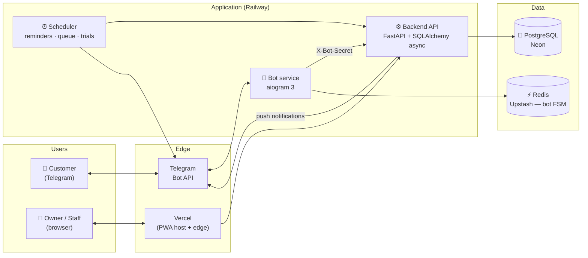

<div align="center">

# 📅 Qulay Navbat

### Telegram‑native booking & queue platform for Uzbekistan's small businesses

*Barbers, salons, and clinics take reservations right inside Telegram — the app 30M+ Uzbeks already use every day. No customer app to install, no friction.*

[](https://github.com/Otabekev/ResevationApp/actions/workflows/ci.yml)


</div>

---

## The problem

In Uzbekistan, small service businesses still book customers by **phone calls, paper notebooks, and Telegram DMs**. That means missed calls during a haircut, double‑bookings, no reminders, and no‑shows that quietly cost owners a third of their day. Western booking apps don't fit: they assume customers will install *yet another app* and sign up with email — behaviour that barely exists here.

## The solution

**Qulay Navbat meets everyone where they already are — Telegram.**

- **Customers** book in a few taps inside a Telegram bot. No install, no signup, no password — their Telegram account *is* their identity.
- **Businesses** get a clean, installable **PWA dashboard** to manage services, staff, schedules, and analytics.
- The platform is **multi‑tenant SaaS**: one deployment serves many businesses, each fully isolated.

What makes it more than "a booking bot" is that it models **three different real‑world scheduling styles** — most competitors only do one.

<div align="center">

### 🔗 Live

**Owner dashboard →** [qulaynavbat.com](https://qulaynavbat.com) · **Customer bot →** `@YourBot` *(add your bot link here)*

</div>

---

## ✨ Key features

### Three scheduling models (pick per business, per service, even per staff member)
| Model | For whom | How it works |
|---|---|---|
| 🗓 **Appointments** | Barbers, salons | Classic time‑slot booking with real‑time availability, buffers, and working hours. |
| 🦷 **Consult‑first** | Dentists, specialists | Some services are hidden from public booking (staff‑scheduled only). A **treatment plan** reserves several visits for one patient at once; the patient gets one Telegram summary + per‑visit reminders. |
| 🎫 **Live queue** | Walk‑in clinics with variable hours | Customers *join a line* instead of picking a time — they get a ticket with their **position + estimated turn time (≈10:00)**, a one‑tap "still coming?" nudge as they near the front, and a live desk view for staff. |

### Role‑based, self‑service platform
- 👑 **Owner** — full dashboard: bookings, services, staff, schedule, analytics, storefront.
- 🧑‍💼 **Secretary / desk‑manager** — runs the front desk without touching business settings.
- 🩺 **Provider (doctor/barber)** — their **own** scoped dashboard: their day, their bookings, their queue, their working hours & **breaks / time‑off**, their stats — and nothing else. Enforced by a row‑level authorization layer (adversarially reviewed for cross‑provider isolation).
- 🛡 **Super‑admin** — platform oversight, business approvals, broadcasts.
- 👤 **Customer** — books, manages, and reviews entirely inside Telegram.

### Built for the real world
- 🌐 **Trilingual** — Uzbek, Russian, English throughout bot + dashboard.
- 🔔 **Smart notifications** — 24h & 1h reminders, "your turn" pings, treatment‑plan summaries — all sent by the backend so they never block a request.
- 📴 **Slow‑network aware** — connection pooling, in‑place message edits, CDN‑cached storefront photos, and instant button acknowledgement for 3G/rural users.
- 🖼 **PWA** — installable, offline‑precached shell, code‑split routes for fast first paint on mid‑range Androids.
- 📊 **Per‑business analytics** — bookings, no‑show rate, busiest services, 7‑day trend.

---

## 🏗 Architecture

A three‑service system behind one Postgres database, deployed across managed platforms.



**Why it's shaped this way**
- **Bot and backend are separate services** — a Telegram outage or a booking‑traffic spike in one can't take down the other; both scale independently.
- **The backend is the single source of truth** — the bot and PWA are thin clients; all authorization, availability math, and tenant isolation live in one audited place.
- **Notifications are push‑based and backgrounded** — the DB connection is freed *before* any slow Telegram HTTP, so a send latency spike during a booking burst can't starve the pool.
- **Availability is computed on demand** from working hours − breaks − time‑off − existing bookings (with per‑service buffers), and double‑booking is prevented at the database level.

More depth: [`docs/ARCHITECTURE.md`](docs/ARCHITECTURE.md).

---

## 🛠 Tech stack

| Layer | Tech |
|---|---|
| **Bot** | Python · [aiogram 3](https://aiogram.dev) · Redis FSM |
| **Backend** | [FastAPI](https://fastapi.tiangolo.com) · SQLAlchemy 2 (async) · Pydantic 2 · Alembic · APScheduler |
| **Frontend** | React 18 · Vite 6 · installable PWA · code‑split routes |
| **Data** | PostgreSQL 16 (Neon) · Redis (Upstash) |
| **Infra** | Railway (backend + bot, Docker) · Vercel (PWA) · GitHub Actions CI |

---

## 📁 Project structure

```
.
├── backend/          FastAPI API — the source of truth
│   ├── app/
│   │   ├── routers/      HTTP endpoints (bookings, queue, staff, schedules, analytics, admin…)
│   │   ├── services/     booking engine, scheduler, notifications
│   │   ├── models/       SQLAlchemy models
│   │   ├── deps.py       centralized authorization (owner / manager / provider / admin)
│   │   └── main.py
│   ├── alembic/         database migrations
│   └── tests/           ~200 tests (unit · integration · multi‑tenant isolation · concurrency)
├── bot/              Telegram bot (aiogram) — the customer surface
│   ├── handlers/        booking flow, queue, my‑bookings, onboarding
│   └── locales/         uz · ru · en
├── frontend/         React PWA — the business dashboard
│   └── src/{pages,components,api,i18n}
├── docs/             architecture, deployment, runbook, roadmap, audits
└── .github/workflows CI (Postgres tests + migration reversibility + frontend build)
```

---

## 🚀 Getting started

### Prerequisites
- Docker + Docker Compose (easiest), or Python 3.12 + Node 20 for manual runs
- A Telegram bot token from [@BotFather](https://t.me/BotFather)

### 1. Configure
```bash
cp .env.example .env
# fill in TELEGRAM_BOT_TOKEN, TELEGRAM_BOT_USERNAME, SECRET_KEY, BOT_SECRET
```

### 2. Run the whole stack (Docker)
```bash
docker compose -f docker-compose.dev.yml up --build
```
This brings up Postgres, Redis, the API, the bot, and the frontend dev server. Migrations apply automatically.

### 3. …or run pieces manually
```bash
# Backend
cd backend && pip install -r requirements-dev.txt
alembic upgrade head
uvicorn app.main:app --reload

# Bot
cd bot && pip install -r requirements.txt && python main.py

# Frontend
cd frontend && npm install && npm run dev
```

---

## 🧪 Testing & quality

Quality is enforced in CI on every push — see [`.github/workflows/ci.yml`](.github/workflows/ci.yml):

- **~200 backend tests** — unit, integration, and **multi‑tenant isolation** (one business can never touch another's data), run against **real PostgreSQL 16** in CI.
- **Concurrency test** — a genuine two‑transaction double‑booking race, provably rejected by a database exclusion constraint.
- **Migration reversibility** — every migration is applied *and reversed* against Postgres in CI.
- **Frontend build** — the PWA is built on every push.

```bash
cd backend && pytest -q          # 197 passed locally; +concurrency test in CI
cd frontend && npm run build     # production PWA build
```

The codebase also carries a documented **production‑readiness hardening pass** (security, correctness, tenant isolation, scale) with a fix‑by‑fix changelog — see [`docs/`](docs/).

---

## 🗺 Roadmap

- ✅ Three scheduling models (appointments · consult‑first · live queue)
- ✅ Role‑based dashboards incl. provider self‑service (breaks & time‑off)
- ✅ Trilingual bot + PWA, reminders, analytics, treatment plans
- 🔜 Payments (manual → integrated), loyalty, richer analytics
- 🔜 Multi‑city rollout beyond the pilot district

Full backlog in [`docs/ROADMAP.md`](docs/ROADMAP.md).

---

## 📸 Screenshots

> _Drop a few images in `docs/screenshots/` and embed them here — the owner dashboard, the bot booking flow, and the live queue make the strongest impression._

| Owner dashboard | Bot booking flow | Live queue |
|---|---|---|
| _add image_ | _add image_ | _add image_ |

---

## 📄 License

© 2026 Otabek Ergashaliyev. All rights reserved. See [`LICENSE`](LICENSE).

<div align="center">
<sub>Built for real businesses in Uzbekistan · Telegram‑first · production‑deployed</sub>
</div>
