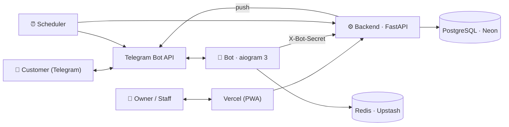

# Architecture

Qulay Navbat is a multi‑tenant SaaS made of three deployable services sharing one
PostgreSQL database. This document explains how they fit together and the design
decisions behind them.

## System overview



## Services

### Backend API (FastAPI, async SQLAlchemy)
The single source of truth. Everything else is a thin client.
- **Routers** expose HTTP endpoints for bookings, the live queue, staff, schedules,
  services, analytics, auth, and admin.
- **Services** hold the real logic: the **booking engine** (availability + conflict
  prevention), the **scheduler** (reminders, queue maintenance, trial expiry), and
  **notifications**.
- **`deps.py`** is the centralized authorization layer. Every business‑scoped
  endpoint passes through one of a small set of choke points:
  - `authorize_business_access` — owner / super‑admin / active desk‑manager.
  - `authorize_business_or_provider` — the above (whole business) **or** a provider
    scoped to *their own* staff rows only.
  - `authorize_provider_access` — a provider's own records only.
  This makes multi‑tenant and cross‑provider isolation auditable in one place.

### Bot (aiogram 3)
The customer‑facing surface and the business onboarding funnel. Conversation state
(which step of the booking flow a user is on) lives in Redis so the bot is
stateless and restart‑safe. The bot authenticates to the backend with a shared
`X-Bot-Secret`; only then does the backend trust the `telegram_id` it forwards.

### Frontend (React + Vite PWA)
The business dashboard. Installable, offline‑precached shell, code‑split routes.
Role is resolved per business (`access_role`: owner / manager / provider) and the
UI adapts — but the backend enforces every rule regardless of what the UI shows.

## Key design decisions

**Bot and backend are separate deployments.** A Telegram outage or a booking spike
in one service can't take down the other, and each scales independently.

**Availability is computed on demand**, never precomputed. For a given staff member
on a given day it is:

```
working hours  −  breaks  −  time‑off (blocked times)  −  existing bookings (± buffers)
```

Business‑wide rows (`staff_id = NULL`) apply to everyone; personal rows
(`staff_id` set, `business_id = NULL`) apply to only that provider — so a doctor's
lunch break removes only *their* slots. A guard in the engine ensures a
mis‑written row can never blanket the whole shop.

**Double‑booking is prevented at the database**, not just in application code — a
real two‑transaction race is covered by a Postgres concurrency test in CI.

**Notifications are push‑based and backgrounded.** The backend resolves all the
message data while the request's DB session is open, then hands the actual Telegram
HTTP to a background task and returns — so the pooled connection is freed *before*
any slow external call, and a send‑latency spike during a booking burst can't
starve the connection pool.

**The live queue costs scale with taps, not idle time.** A person's position is a
single indexed `COUNT`, computed on demand; there is no background loop keeping
positions in sync. The one periodic sweep only touches the front of each line.

## Data model (core entities)

- **Business** — a tenant. Has services, staff, working hours, bookings, a queue.
- **Staff** — a provider or a desk‑manager; may be linked to a user account.
  Flags: `is_provider`, `can_manage`, `scheduling_mode`.
- **Service** — bookable unit with duration + buffers; `online_bookable`,
  `max_per_day` power the consult‑first model.
- **Booking** — a reserved slot; the availability engine reads and writes these.
- **QueueEntry** — a person in a live walk‑in line.
- **WorkingHours / BreakTime / BlockedTime** — schedule rules, business‑wide or
  per‑staff.
- **Customer / User** — a Telegram‑identified person; role drives access.

## Deployment

Migrations run as a Railway **pre‑deploy step** (`alembic upgrade head`) in a
separate container before a release is promoted; a failed migration rejects the
release and the previous one keeps serving. See [`DEPLOYMENT.md`](DEPLOYMENT.md)
and [`RUNBOOK.md`](RUNBOOK.md).
